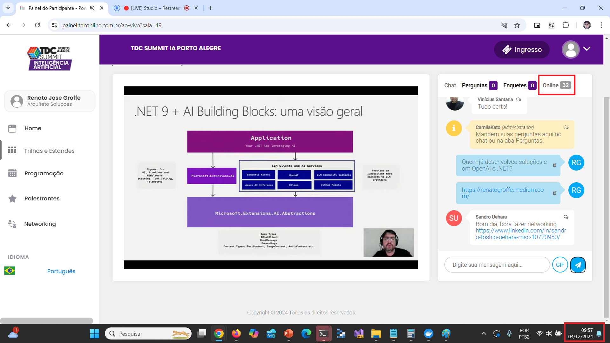

# DotNet9-AIBuildingBlocks_TDC-PortoAlegre-2024-12
Slides e conteúdos da apresentação **.NET 9 + AI Building Blocks: simplificando o desenvolvimento de soluções de IA na plataforma .NET**. Palestra realizada no dia 04/12/2024, durante o TDC SUMMIT PORTO ALEGRE.

---

Título da apresentação: **.NET 9 + AI Building Blocks: simplificando o desenvolvimento de soluções de IA na plataforma .NET**

Data: **04/12/2024 (quarta-feira)**

Tipo do evento: **Online**

Evento: **TDC Summit IA Porto Alegre 2024**

Tipo do evento: **Online**

Ferramenta de transmissão: **Restream**

Tecnologias e tópicos abordados: **.NET 9, OpenAI, Azure OpenAI, Ollama, Llama, C#, Visual Studio 2022, Visual Studio Code**

Número de participantes: **32 pessoas (pico de audiência ao longo da live)**

Link do evento: **https://promo.thedevconf.com/sumiapoa-microsoft**

Deixo aqui meus agradecimentos ao **Rogério Rodrigues** por todo o apoio para que eu participasse como palestrante de mais uma edição do **TDC**.

---

